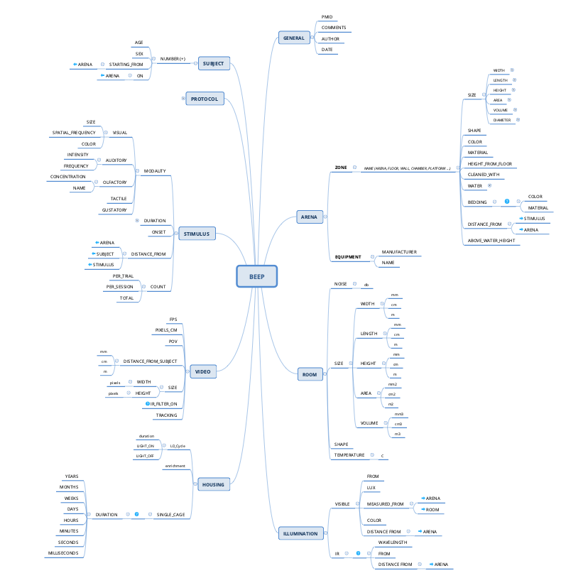

# Behavioral Experiment Enhancement Protocol (BEEP)

A controlled dictionary that can be used both to report behavioral protocols and to perform meta-analyses.
The tree is used to capture variability in behavioral experiment procedures. Not all fields must be completed.

### How to use
The steps to apply the controlled dictionary are the following:
1. Perform a preliminary review of the literature to identify features that best capture the logic, structure and contingencies of the behavioral assay
2. Select the fields in the dictionary that are in line with the features extracted from the literature
3. Use the selected fields to extract information from the _Materials & Methods_ section
4. Refine ...

### File formats
The present repository contains the dictionary stored in 3 different formats:
- Mind map      (.xmind)
- Open document (.ods
- Graphical     (.png)

#### Graph
The dictionary is best viewed as a tree diagram:

