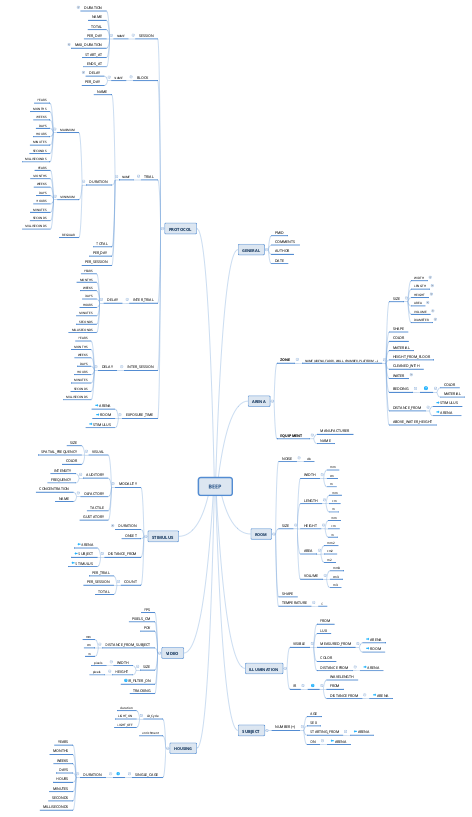

# Behavioral Experiment Protocol Enhancement

A controlled dictionary that can be used both to report behavioral protocols and to perform meta-analyses.

The dictionary is best viewed as a tree diagram

the tree is used to capture variability in behavioral experiment procedures.

