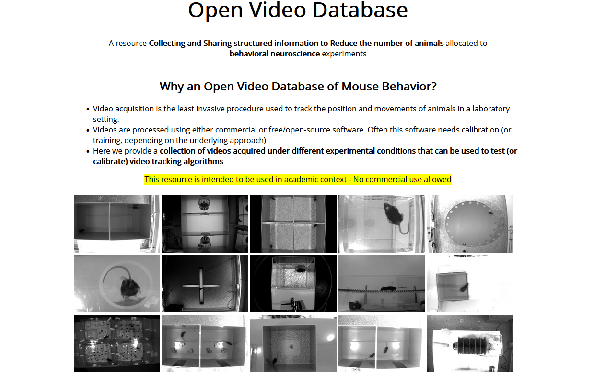

# Open video database (2021)

A preliminary idea to share our large database of videos.

We have access to a vast array of behavioral assays filmed from different angle and different lighting conditions.

The associated metadata are tailored to the intended use of the video: automated tracking optimization. No information about the subjects and purpose of the study is shared.

